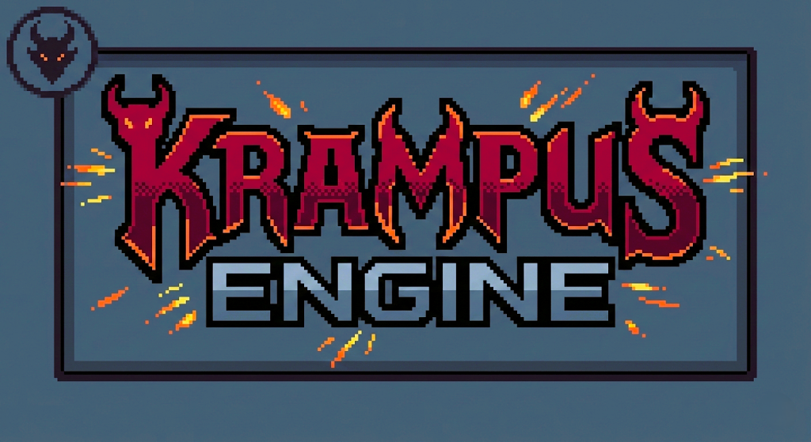

KrampusEngine

      
 
 A modern <b>2D experimental game engine</b> written in <b>C++20</b>, focused on  engine architecture, memory safety, and runtime systems. 

Overview

KrampusEngine is a code-driven 2D game engine built on top of SFML 3.0.0.
It provides a clean and modular engine architecture without any graphical editor,
designed to explore low-level engine systems and modern C++ practices.

The engine and the game are strictly separated:

the engine is compiled as a static library (.lib)

the game is compiled as an executable (.exe) linked against the engine

Project Goals

Design a reusable and extensible engine architecture

Apply modern C++20 features and RAII principles

Implement core engine systems from scratch

Build a complete game without relying on a prebuilt engine

This project is primarily focused on learning, technical challenge, and engine design.

Features

🧩 Hybrid Actor / Component system
(Unity-style components with Unreal-like actor logic)

🎮 Runtime-defined level system

📡 Synchronous event system (Observer / Listener)

🧠 Fully automatic memory management

🧵 Multithreaded logging system

🐞 Configurable Debug / Release builds

⌨️ Input handling system

💥 Custom 2D collision system

🎞️ Sprite-based animation system

🧱 Clean Engine / Game separation

Architecture
/Engine   → Core engine systems
/Game     → Game-specific logic and entry point

Engine systems are fully encapsulated

The game interacts only through the engine’s public API

The engine is designed as a reusable static library

Memory Management

Exclusive use of smart pointers

Direct allocation (new) is forbidden on the user side

Ownership and lifetime fully managed by the engine

RAII-based architecture

Memory leak detection enabled in Debug builds (Windows tools)

Event System

Observer / Listener architecture

Synchronous event dispatch

Used for communication between engine systems and gameplay logic

Gameplay Systems
Actors & Components

Actors can contain multiple components

Actors may also implement their own behavior

Hybrid design inspired by Unity and Unreal Engine

Levels

Levels are defined as C++ classes

Created and initialized at runtime

Offers full control and flexibility

Collision System

2D-only collision system

Supported collision types:

AABB

OBB

Circle–Circle

Circle–Rectangle

Fully custom implementation (independent of SFML)

Animation System

2D sprite-based animations

Spritesheet-driven playback

Timer-based frame updates

Lightweight design without state machines

Debugging & Logging
Logging

Dedicated logging thread

Colored console output

Persistent log file (log.txt)

Build Configurations
Mode	Logs	Debug Tools	Leak Detection	Console
Debug	✔️	✔️	✔️	✔️
Release	❌	❌	❌	❌
Build & Platform

🛠 Project generation via Premake5

🧱 Built with Visual Studio

🪟 Windows only

📐 C++ standard: C++20

📦 Dependency: SFML 3.0.0

Known Limitations

❗ Engine is not thread-safe
(intentional design choice to simplify architecture)

❗ Windows platform only

❗ No editor or graphical interface

❗ 2D-focused engine

Project Status

🚧 Actively developed

✅ Core systems implemented

🎮 Demo game in progress to showcase engine features

Motivation

KrampusEngine is a personal project created to:

Push my technical limits

Improve my understanding of engine-level programming

Gain experience with large-scale C++ architecture

Build a complete game engine instead of using a prebuilt solution
